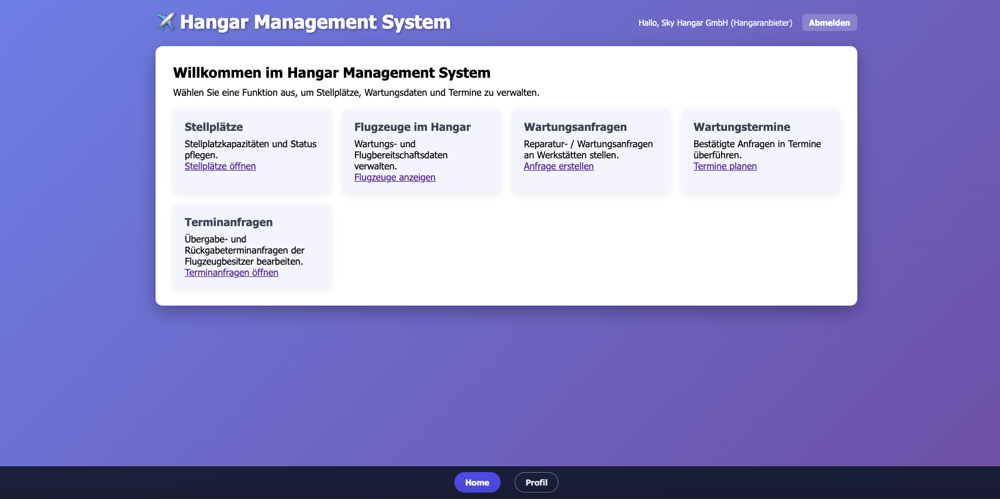
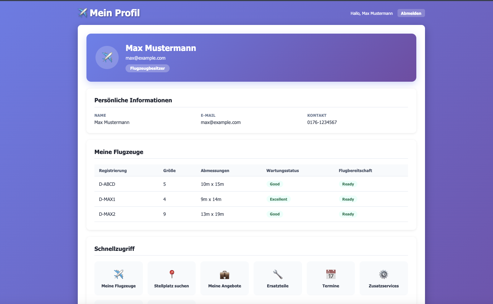
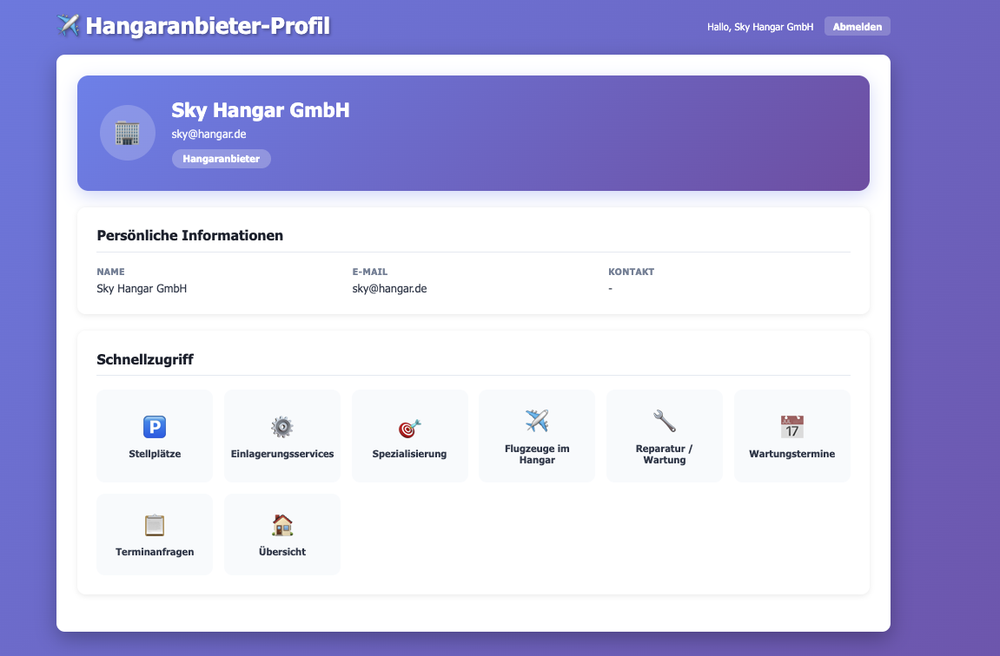
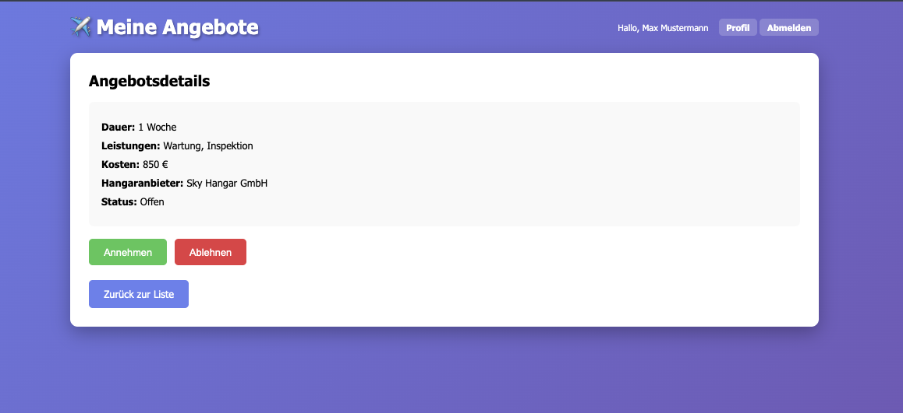

# Hangar Management System

Spring‑Boot‑Anwendung zur Verwaltung von Flugzeughangars – mit getrennten Use Cases für **Flugzeugbesitzer (FB)** und **Hangaranbieter (HA)**.

## Schnellstart

### Voraussetzungen

- Java 21  
- Maven 3.6+  
- Docker & Docker Compose (empfohlen)  

### 1. Backend & Datenbank mit Docker starten (empfohlen)

1. **PostgreSQL + pgAdmin starten**

   ```bash
   docker-compose up -d
   ```

   Standard‑Konfiguration (`docker-compose.yml`):

   - PostgreSQL: `localhost:5433`, Datenbank `hangardb`, Benutzer/Passwort `postgres` / `postgres`
   - optional: pgAdmin (lokal installierte App)

2. **Spring‑Boot‑Anwendung starten**

   ```bash
   mvn spring-boot:run
   ```

3. **Frontend im Browser öffnen**

   ```text
   http://localhost:8082
   ```

4. **(Optional) Daten in der DB ansehen**

   - psql im Container:

     ```bash
     docker exec -it hangar-postgres psql -U postgres -d hangardb
     ```

### 2. Neuer Entwickler‑Setup in Kurzform

1. Repository klonen  
2. `docker-compose up -d` ausführen  
3. `mvn spring-boot:run` starten  
4. Browser öffnen: `http://localhost:8082`  

Beim ersten Start (`hangardb` leer) legt der `DataLoader` automatisch Testdaten an.

## Konfiguration

Zentrale Einstellungen in `src/main/resources/application.properties`:

```properties
spring.datasource.url=jdbc:postgresql://localhost:5433/hangardb
spring.datasource.username=postgres
spring.datasource.password=postgres

spring.jpa.hibernate.ddl-auto=update
spring.jpa.show-sql=true
spring.jpa.properties.hibernate.format_sql=true

server.port=8082
```

`data.sql` wird **nicht** aktiv verwendet; Initialdaten kommen über `DataLoader.java`.

## Initialdaten (DataLoader)

Beim ersten Start einer leeren Datenbank erzeugt der `DataLoader` automatisch Testdaten, u. a.:

- 3 Flugzeugbesitzer (`AircraftOwner`)  
- 6 Hangaranbieter (`HangarProvider`)  
- 3 Teileanbieter (`PartsProvider`)  
- 6 Ersatzteile (`SparePart`)  
- 5 Flugzeuge (`Aircraft`)  
- 7 Services  
- 9 Stellplätze (`Parking`)  
- ServiceRequests, Offers, Übergabe‑/Rückgabetermine, Zusatzservice‑Buchungen, Appointments, Ersatzteile‑Reservierungen, AircraftTypes

**Test‑Benutzer für schnellen Einstieg:**

- **Flugzeugbesitzer (FB):**
  - E‑Mail: `max@example.com`  
  - Passwort: `pass123`  
  - Name: Max Mustermann  
  - Verfügt über: 3 Flugzeuge, ServiceRequests, Offers, Zusatzservice‑Buchungen, Ersatzteile‑Reservierungen

- **Hangaranbieter (HA):**
  - E‑Mail: `sky@hangar.de`  
  - Passwort: `hp123`  
  - Name: Sky Hangar GmbH  
  - Standort: Berlin  
  - Verfügt über: 4 eingelagerte Flugzeuge, 5 Services, 2 ServiceRequests , 1 Appointment , Spezialisierung (3 Flugzeugtypen), Stellplätze

Mit diesen Test‑Benutzern können alle Use Cases direkt getestet werden, ohne neue Konten anzulegen. Die Initialdaten decken die wichtigsten Szenarien ab.

Ist bereits Inhalt in der Datenbank vorhanden, überspringt der DataLoader den Import.

## Screenshots

Einige Beispielansichten aus der Anwendung:

- **Hangaranbieter‑Dashboard (HA)**  
  

- **Flugzeugbesitzer‑Profil (FB)**  
  

- **Hangaranbieter‑Profil (HA)**  
  

- **Meine Angebote (FB)**  
  

## Architektur – Überblick

Die Anwendung folgt dem klassischen Spring‑Boot‑Schema:

- **Model (Entities)** – `de.thm.mni.model`  
  JPA‑Entities für die Domänenobjekte, z. B.:

  - `Aircraft`, `AircraftOwner`, `HangarProvider`, `Parking`, `Location`
  - `Service`, `ServiceRequest`, `Offer`, `SparePart`
  - `MaintenanceStatus`, `FlightReadiness`, `Appointment`, `HandoverReturnAppointment`

- **Repositories** – `de.thm.mni.repository`  
  Spring‑Data‑Interfaces für den Datenzugriff, z. B.:

  - `AircraftRepository`, `AircraftOwnerRepository`, `HangarProviderRepository`
  - `ParkingRepository`, `ServiceRepository`, `ServiceRequestRepository`
  - `MaintenanceStatusRepository`, `FlightReadinessRepository` usw.

- **Services & Kataloge** – `de.thm.mni.service`  
  Enthalten die Geschäftslogik und setzen die Kommunikationsdiagramme (KD.HA.x / KD.FB.x) um:

  - Services: `HPService`, `AircraftService`, `ParkingService`, `SpecializationService`,  
    `SRequestManagement` (HA.6), `AppointmentService` (HA.7), `BookingService`, `OfferService` …
  - Kataloge: `HPCatalog`, `ACCatalog`, `ACOCatalog`, `ACTypeCatalog`, `StatusCatalog`,  
    `SRequestCatalog`, `AppointmentCatalog`, `ParkingCatalog`, `ServiceCatalog`, `PartsCatalog` …

- **Controller** – `de.thm.mni.controller`  
  REST‑Controller verbinden Frontend und Backend, z. B.:

  - `AuthController`, `AircraftOwnerController`, `AircraftOwnerProfileController`, `AircraftController`
  - `ParkingController`, `LocationController`, `SearchParkingController`
  - `ServiceController`, `SpecializationController`, `StatusController`
  - `ServiceRequestController`, `AppointmentController`, `HandoverAppointmentController`
  - `OfferController`, `BookingController`, `ArticleReservationController`
  - `HangarProviderController` (Admin/Listenansicht für Hangaranbieter)

- **DTOs** – `de.thm.mni.dto`  

  - `LoginRequest`, `RegisterAircraftOwnerRequest`, `RegisterHangarProviderRequest`  
  - `AuthResponse` (Login/Registrierung ohne Passwort)  
  - `InquiryRequest`, `ErrorMessage`

- **Frontend (HTML/CSS/JS)** – `src/main/resources/static`  
  Reine HTML‑Seiten mit `css/styles.css` + `js/auth.js`/`js/app.js`.

  - Startseite: `index.html` (Dashboard für beide Rollen + Admin‑Tabs für CRUD)  
  - Flugzeugbesitzer (FB):  
    `login.html`, `register.html`, `profile.html`, `meine-flugzeuge.html`,  
    `parking-search.html`, `location-details.html`, `meine-angebote.html`,  
    `ersatzteile.html`, `uebergabe-termine.html`, `zusatzservices.html`,  
    `meine-buchungen.html`
  - Hangaranbieter (HA):  
    `hp-profile.html`, `stellplaetze.html`, `einlagerungsservices.html`,  
    `spezialisierung.html`, `flugzeuge-im-hangar.html`,  
    `reparatur-wartungsanfrage.html`, `wartungstermine.html`,  
    `terminanfragen.html`

## Implementierte Use Cases (FB & HA)

Alle in der Dokumentation beschriebenen Use Cases für **FB** (Flugzeugbesitzer) und **HA** (Hangaranbieter) sind implementiert.  
Für jeden Use Case gibt es:

- einen vollständigen Backend‑Flow (Controller → Service/Katalog → Repository/Entity)  
- eine passende HTML/JS‑Seite im Frontend

### Use Cases für Flugzeugbesitzer (FB)

- **Flugzeugbesitzer – Profil und Flugzeuge verwalten**  
  - Frontend: `profile.html`, `meine-flugzeuge.html`  
  - Backend: `AircraftOwnerProfileController`, `AircraftController`, `AircraftService`

- **Stellplatz suchen und Standortdetails einsehen**  
  - Frontend: `parking-search.html`, `location-details.html`  
  - Backend: `SearchParkingController`, `LocationController`, `ParkingRepository`

- **Serviceanfrage erstellen und Zusatzservices buchen**  
  - Frontend: `location-details.html`, `zusatzservices.html`, `meine-buchungen.html`  
  - Backend: `ServiceRequestController`, `SRequestManagement`, `BookingController`, `BookingService`

- **Angebote verwalten**  
  - Frontend: `meine-angebote.html`  
  - Backend: `OfferController`

- **Übergabe‑ und Rückgabetermine verwalten**  
  - Frontend: `uebergabe-termine.html`  
  - Backend: `HandoverAppointmentController`, `AppointmentService`

- **Ersatzteile anzeigen und reservieren**  
  - Frontend: `ersatzteile.html`  
  - Backend: `PartsController`, `ArticleReservationController`

### Use Cases für Hangaranbieter (HA)

- **Hangaranbieter‑Profil anlegen und pflegen**  
  - Frontend: `hp-profile.html`, `index.html`  
  - Backend: `AuthController`, `HPService`

- **Stellplätze verwalten**  
  - Frontend: `stellplaetze.html`  
  - Backend: `ParkingController`, `ParkingService`

- **Einlagerungsservices verwalten**  
  - Frontend: `einlagerungsservices.html`  
  - Backend: `ServiceController`, `HPService`

- **Spezialisierung nach Flugzeugtypen**  
  - Frontend: `spezialisierung.html`  
  - Backend: `SpecializationController`, `SpecializationService`, `ACTypeCatalog`, `HPCatalog`

- **Wartungs‑ und Flugbereitschaftsdaten bereitstellen**  
  - Frontend: `flugzeuge-im-hangar.html`  
  - Backend: `StatusController`, `HPService.saveInput`, `StatusCatalog`

- **Reparatur‑ und Wartungsanfragen erfassen**  
  - Frontend: `reparatur-wartungsanfrage.html`  
  - Backend: `ServiceRequestController`, `SRequestManagement`, `SRequestCatalog`, `MPCatalog`

- **Wartungs‑ und Reparaturtermine planen**  
  - Frontend: `wartungstermine.html`  
  - Backend: `AppointmentController`, `AppointmentService`  
    (inkl. Aktualisierung des Wartungsstatus des zugehörigen Flugzeugs)

Damit sind alle relevanten FB‑ und HA‑Use Cases im System technisch und fachlich abgedeckt.

## Entwicklung

- Build:

  ```bash
  mvn clean install
  ```

## Troubleshooting

- **Datenbank/Container läuft nicht**

  ```bash
  docker-compose up -d
  ```

- **Port 5433 oder 8082 schon belegt**

  → Ports in `docker-compose.yml` bzw. `src/main/resources/application.properties` anpassen.

